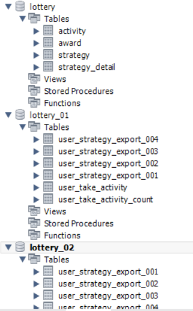

# 抽奖系统数据库设计

## 表关系以及字段设计

#### 活动表

> 用来配置抽奖活动的总表, 用于存放活动信息, 主要包括: id,
> 名称, 描述, 开始时间, 结束时间, 库存, 参与次数

```sql
create table activity
(
    id            bigint auto_increment comment '自增ID',
    activityId    bigint null comment '活动ID',
    activityName  varchar(64) not null comment '活动名称',
    activityDesc  varchar(128) null comment '活动描述',
    beginDateTime datetime    not null comment '开始时间',
    endDateTime   datetime    not null comment '结束时间',
    stockCount    int         not null comment '库存',
    takeCount     int null comment '每人可参与次数',
    state         int null comment '活动状态：编辑、提审、撤审、通过、运行、拒绝、关闭、开启',
    creator       varchar(64) not null comment '创建人',
    createTime    datetime    not null comment '创建时间',
    updateTime    datetime    not null comment '修改时间',
    constraint activity_id_uindex
        unique (id)
) comment '活动配置';

alter table activity
    add primary key (id);

```

#### 奖品配置

> 用于配置具体可以得到的奖品

```sql
create table award
(
    id           bigint(11) auto_increment comment '自增ID'
        primary key,
    awardId      bigint null comment '奖品ID',
    awardType    int(4) null comment '奖品类型（文字描述、兑换码、优惠券、实物奖品暂无）',
    awardCount   int null comment '奖品数量',
    awardName    varchar(64) null comment '奖品名称',
    awardContent varchar(128) null comment '奖品内容「文字描述、Key、码」',
    createTime   datetime default CURRENT_TIMESTAMP null comment '创建时间',
    updateTime   datetime default CURRENT_TIMESTAMP null comment 'updateTime'
) comment '奖品配置';

```

#### 策略配置

> 用于配置抽奖策略, 概率, 玩法, 库存, 奖品

```sql
create table strategy
(
    id           bigint(11) auto_increment comment '自增ID'
        primary key,
    strategyId   bigint(11) not null comment '策略ID',
    strategyDesc varchar(128) null comment '策略描述',
    strategyMode int(4) null comment '策略方式「1:单项概率、2:总体概率」',
    grantType    int(4) null comment '发放奖品方式「1:即时、2:定时[含活动结束]、3:人工」',
    grantDate    datetime null comment '发放奖品时间',
    extInfo      varchar(128) null comment '扩展信息',
    createTime   datetime null comment '创建时间',
    updateTime   datetime null comment '修改时间',
    constraint strategy_strategyId_uindex
        unique (strategyId)
) comment '策略配置';

```

#### 策略明细

> 用于配置策略的具体明细配置

```sql
create table strategy_detail
(
    id         bigint(11) auto_increment comment '自增ID'
        primary key,
    strategyId bigint(11) not null comment '策略ID',
    awardId    bigint(11) null comment '奖品ID',
    awardCount int null comment '奖品数量',
    awardRate  decimal(5, 2) null comment '中奖概率',
    createTime datetime null comment '创建时间',
    updateTime datetime null comment '修改时间'
) comment'策略明细';

```

#### 用户参与记录表

> 分库不分表

> 每个用户参与活动都会记录其参与信息, 时间, 次数

#### 用户活动参与次数表

> 分库不分表

> 用于记录当前参与了多少次

```sql
create
database lottery_01;

-- auto-generated definition
create table user_take_activity
(
    id           bigint null,
    uId          tinytext null,
    takeId       bigint null,
    activityId   bigint null,
    activityName tinytext null,
    takeDate     timestamp null,
    takeCount    int null,
    uuid         tinytext null,
    createTime   timestamp null,
    updateTime   timestamp null
) comment '用户参与活动记录表';

-- auto-generated definition
create table user_take_activity_count
(
    id         bigint null,
    uId        tinytext null,
    activityId bigint null,
    totalCount int null,
    leftCount  int null,
    createTime timestamp null,
    updateTime timestamp null
) comment '用户活动参与次数表';

```

#### 用户策略计算结果表

> 分库分表

> 最终策略结果的一个记录, 也就是奖品中奖信息的内容

```sql
-- auto-generated definition
create table user_strategy_export_001
(
    id           bigint null,
    uId          mediumtext null,
    activityId   bigint null,
    orderId      bigint null,
    strategyId   bigint null,
    strategyType int null,
    grantType    int null,
    grantDate    timestamp null,
    grantState   int null,
    awardId      bigint null,
    awardType    int null,
    awardName    mediumtext null,
    awardContent mediumtext null,
    uuid         mediumtext null,
    createTime   timestamp null,
    updateTime   timestamp null
) comment '用户策略计算结果表';
create table user_strategy_export_002
(
    id           bigint null,
    uId          mediumtext null,
    activityId   bigint null,
    orderId      bigint null,
    strategyId   bigint null,
    strategyType int null,
    grantType    int null,
    grantDate    timestamp null,
    grantState   int null,
    awardId      bigint null,
    awardType    int null,
    awardName    mediumtext null,
    awardContent mediumtext null,
    uuid         mediumtext null,
    createTime   timestamp null,
    updateTime   timestamp null
) comment '用户策略计算结果表';
create table user_strategy_export_003
(
    id           bigint null,
    uId          mediumtext null,
    activityId   bigint null,
    orderId      bigint null,
    strategyId   bigint null,
    strategyType int null,
    grantType    int null,
    grantDate    timestamp null,
    grantState   int null,
    awardId      bigint null,
    awardType    int null,
    awardName    mediumtext null,
    awardContent mediumtext null,
    uuid         mediumtext null,
    createTime   timestamp null,
    updateTime   timestamp null
) comment '用户策略计算结果表';
create table user_strategy_export_004
(
    id           bigint null,
    uId          mediumtext null,
    activityId   bigint null,
    orderId      bigint null,
    strategyId   bigint null,
    strategyType int null,
    grantType    int null,
    grantDate    timestamp null,
    grantState   int null,
    awardId      bigint null,
    awardType    int null,
    awardName    mediumtext null,
    awardContent mediumtext null,
    uuid         mediumtext null,
    createTime   timestamp null,
    updateTime   timestamp null
) comment '用户策略计算结果表';

```


## 最终效果


